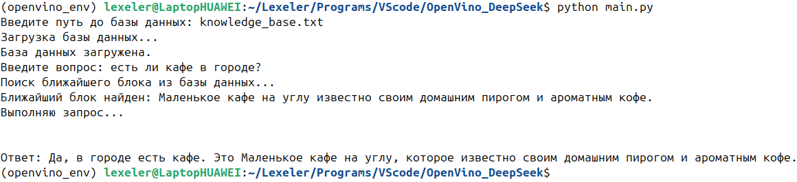
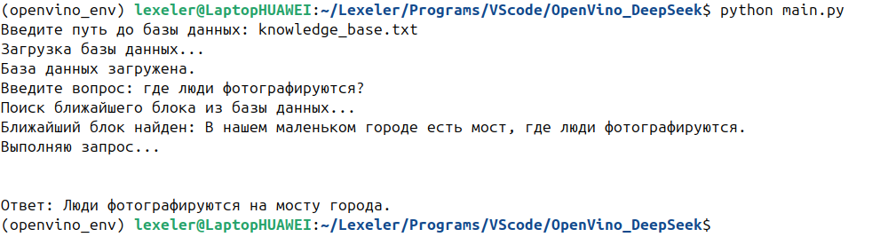
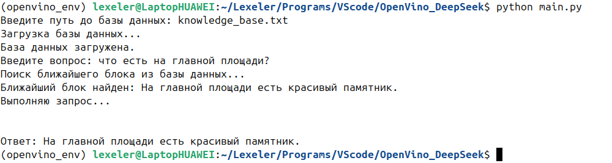
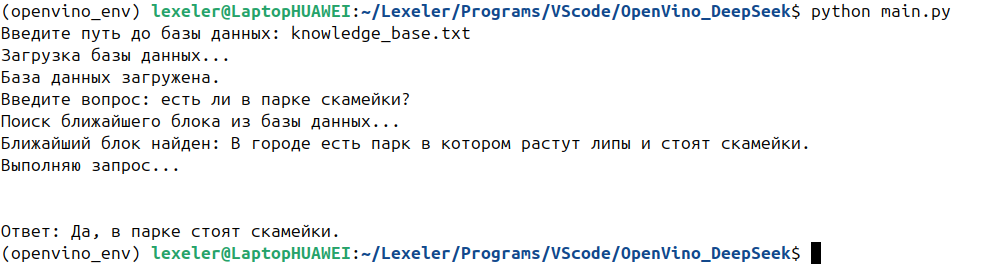

# RAG with local DeepSeek 

## Описание проекта

Этот проект реализует подход Retrieval-Augmented Generation (RaG) на локальной модели `deepseek-ai/DeepSeek-R1-Distill-Qwen-7B`. Система выполняет поиск по базе знаний с использованием векторного поиска FAISS и модели Sentence-Transformers для создания эмбеддингов. После нахождения наиболее релевантного блока базы данных, вопрос и найденный фрагмент отправляются в языковую модель для генерации финального ответа.

## Демонстрация






### Содержимое `knowledge_base.txt` (для демонстрации)

```txt
##
В нашем маленьком городе есть мост, где люди фотографируются.
##
На главной площади есть красивый памятник.
##
В городе есть парк в котором растут липы и стоят скамейки.
##
Маленькое кафе на углу известно своим домашним пирогом и ароматным кофе.
```

### Содержимое `prompts.py` (для демонстрации)

```txt
SYSTEM_PROMPT = '''
Вы — информационный ассистент, отвечающий на вопросы о жизни в нашем маленьком городе.
Вы должны быть дружелюбным, полезным и информативным.
'''
```

## Структура

- `create_or_load_database()` — загружает или пересоздаёт FAISS-индекс из текстовой базы знаний.
- `search()` — ищет наиболее похожий фрагмент текста по введённому вопросу.
- `call_api()` — отправляет запрос к локальной языковой модели.
- `main()` — объединяет все шаги: загрузку базы, ввод вопроса, поиск, запрос к API и вывод ответа.
## Структура базы знаний

Файл базы знаний (`knowledge_base.txt`) должен содержать текст, разделённый на блоки с помощью маркера `##`. Каждый блок будет обрабатываться отдельно и индексироваться.

Пример структуры файла:

```txt
##
Текст первого блока...
##
Текст второго блока...
```


## Скачивание и развертвание локальной модели

- Для скачивания локальной модели `deepseek-ai/DeepSeek-R1-Distill-Qwen-7B`:
Следуйте пошаговым указаниям на указанной странице: [OpenVINO QuickStart - LLM models](https://docs.openvino.ai/2025/model-server/ovms_docs_llm_quickstart.html).

- Модель должна быть развернута по адресу:

```
http://localhost:8000/v3/chat/completions
```
## Использование

1. Клонируйте репозиторий:
   ```bash
   git clone https://github.com/Lexeler/RAG-with-local-DeepSeek
   ```

2. Установите зависимости:
   ```bash
   pip install -r requirements.txt
   ```

3. Запустите скрипт:
   ```bash
   python main.py
   ```

4. Укажите путь к базе знаний или нажмите Enter для использования пути по умолчанию (`knowledge_base.txt`).

5. Введите интересующий вопрос.

6. Получите ответ, сгенерированный локальной языковой моделью на основе найденного фрагмента базы знаний.

## Переменные

- `VECTOR_DB_DIR` — директория, где хранится FAISS-индекс.
- `INDEX_FILE_PATH` — путь к файлу индекса.
- `SYSTEM_PROMPT` — системный промпт для языковой модели (загружается из `prompts.py`).